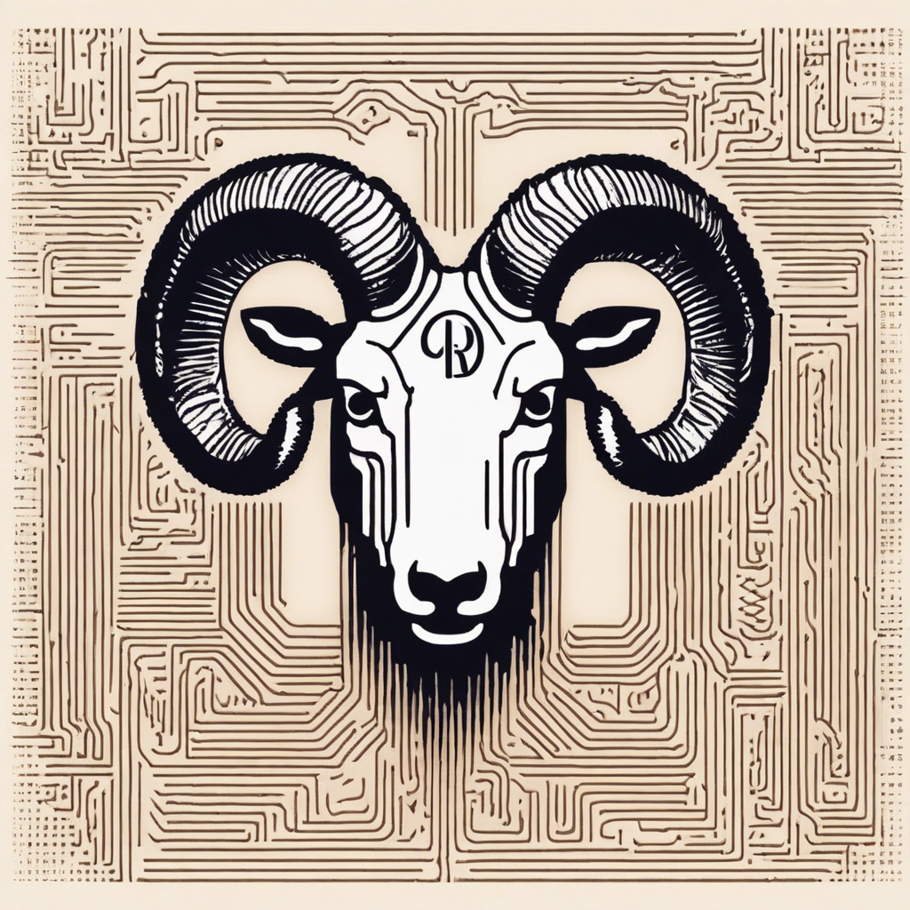

# CommandAI Project Goals and Purposes

From the desk of Alan, the Human:

My mission with the CommandAI project is to engineer Natural Language, Nested Structures for AI Agent Teams, inclusive of individual AI Agent Biographies. We are dedicated to crafting workflows and decision-making processes that inherently prioritize human interaction. The vision is to design autonomous agents that are customized to serve the unique requirements of individuals, human teams, and integrated human-AI units, as well as to facilitate the formation of new teams and the advancement of existing agents.

This initiative is a testament to our commitment to human-centric AI development, ensuring that every step we take is aligned with enhancing human collaboration and efficiency.

Alan

